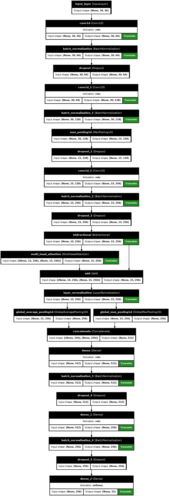

# 🏋️‍♂️ Trika.ai — Unified Fitness Intelligence Monorepo

This repository serves as the central monorepo for the **Trika.ai Ecosystem** containing:

| Component         | Description                                                                                       |
| ----------------- | ------------------------------------------------------------------------------------------------- |
| `trika_backend`   | Backend API powering workout tracking, AI inference, and authentication                           |
| `trika_dashboard` | Web dashboard for users, coaches, and AI-enhanced analytics                                       |
| `demovideos.zip`  | Demo workout files used for **AI Workout Classification Model** training and evaluation (Git LFS) |

Trika.ai combines **Computer Vision**, **Deep Learning**, and **Agentic RAG** to deliver a smart fitness experience, including automatic workout detection, pose correctness scoring, and personalized fitness recommendations.

---

## 📂 Repository Structure

```bash
Trika-MONOREPO/
│
├── trika_backend/         # Submodule: Backend services
├── trika_dashboard/ 
├── screenshots/       # Submodule: Dashboard UI
├── demovideos.zip         # Stored via Git LFS
├── .gitattributes
├── .gitmodules
└── README.md
```

---

## 🧠 Core Features

* Real-time Workout Classification (Squats, Push-ups, Lunges, Planks, etc.)
* Pose Accuracy Scoring using MediaPipe/BlazePose
* Dashboard with Progress Analytics & History
* Coach Mode: AI-driven posture corrections
* Content system for training programs & personalized guidance
* Optimized inference engine for low-latency evaluation

---

## 🤖 Workout Classification Model

Model architecture summary:

* Input: Video frames or real-time webcam feed
* Feature extraction: Pose keypoints (MediaPipe/BlazePose)
* Temporal modeling: CNN + BiLSTM hybrid architecture
* Output: Workout label + confidence + rep count
### Model Inference Flow

```
Video → Pose Extraction → Keypoint Array → Model → Classification + Reps + Form Score
```

---

## 📸 Screenshots & Demo Media
Replace these placeholders with your actual files.
## User Flow 


### 🔷 Dashboard — User Progress & Session History


### 🔷 Live Workout Classification — Web Interface


### 🔷 AI Coach Feedback — Rep Counter & Form Evaluation


## Trika Bot / Trainer


## Trika Soul / Mind


## Challenge AI custum generated (Personalized)


## Habbit And Schedule (Trika Tracker)


---

## 🎥 Workout Classification Demo Video

Embed GIF/MP4 later:


Or link a YouTube demo:

🔗 Demo: *Add YouTube link here*

---

## 🚀 Getting Started

### 1️⃣ Clone with Submodules

```bash
git clone --recurse-submodules https://github.com/kelvinprabhu/Trika-MONOREPO.git
```

### 2️⃣ Backend Setup

```bash
cd trika_backend
# Insert backend startup steps here
```

### 3️⃣ Dashboard Setup

```bash
cd trika_dashboard
# Insert dashboard startup steps here
```

---

## 🧪 Model Notebooks

```
notebooks/
├── workout_classification_training.ipynb
└── pose_feature_extraction.ipynb
```

---

## 🏗️ Tech Stack

| Layer        | Tools                                  |
| ------------ | -------------------------------------- |
| Frontend     | React / Next.js                        |
| Backend      | FastAPI / Django                       |
| AI/ML        | PyTorch, TensorFlow, MediaPipe, OpenCV |
| Vector / RAG | LangChain, Chroma/Pinecone             |
| Database     | MongoDB                                |
| Deployment   | Docker                                 |

---

## 📌 Roadmap

* Mobile Companion App (Flutter/React Native)
* Live Form Correction with Voice Feedback
* Social Fitness Challenges
* Wearable Integration (Garmin, Fitbit, Apple Health, etc.)

---

## 🤝 Contributing

Contributions, research improvements, and dataset enhancements are welcome.

---

## 📧 Contact & Links

| Resource       | Link                                                                                                     |
| -------------- | -------------------------------------------------------------------------------------------------------- |
| Portfolio      | https://kelvinportfolio2071.netlify.app/                                                                                               |
| LinkedIn       |  https://www.linkedin.com/in/a-anto-kelvin-prabhu-48385b25a/                                             |
| Backend Repo   | [https://github.com/kelvinprabhu/Trika.ai_BACKEND](https://github.com/kelvinprabhu/Trika.ai_BACKEND)     |
| Dashboard Repo | [https://github.com/kelvinprabhu/trikaweb_dashboard](https://github.com/kelvinprabhu/trikaweb_dashboard) |


## 🎯 Summary

Trika.ai blends **computer vision**, **human biomechanics**, and **LLM-powered coaching** to make fitness training more intelligent, personalized, and scalable.
## Model Architecture

